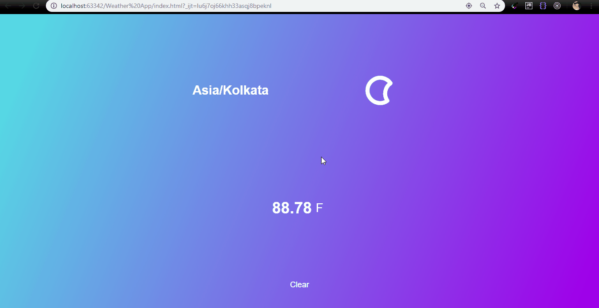

 ### Important! :: You have to allow the app to access you location and also to load scripts only then results would be displayed :sparkling_heart:

# Weather-App

> A basic **weather-app** that displays the **Temperature** and **day-summary** along with nice **SVG-Icons**

### Deployment :star: : https://knifeparty12.github.io/Weather-App/

### Pre-requisites
 
*[1] Basic CSS.*  
*[2]  Basic Vanilla JavaScript.*  

### Dependencies

> We are going to be using [Darksky](https://darksky.net) api to pull all the necessary weather information you need.
Darksky can be used free for up to 1000 api calls, so it is great for a demo project.

> Using [Skycons](https://darkskyapp.github.io/skycons/) for weather icons to be displayed

> Use of [Navigator](https://developer.mozilla.org/en-US/docs/Web/API/Navigator/geolocation) inbuilt object inside JS that gives Web content access to the location of the device. 
This allows a Web site or app to offer customized results based on the user's location.

